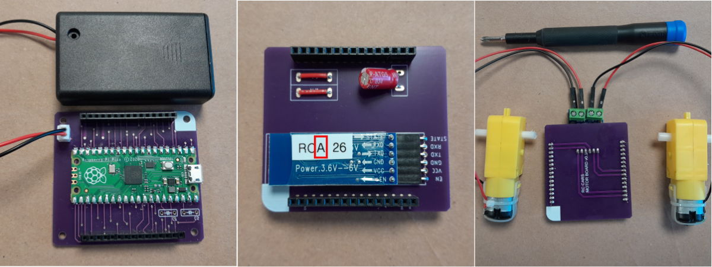
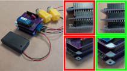
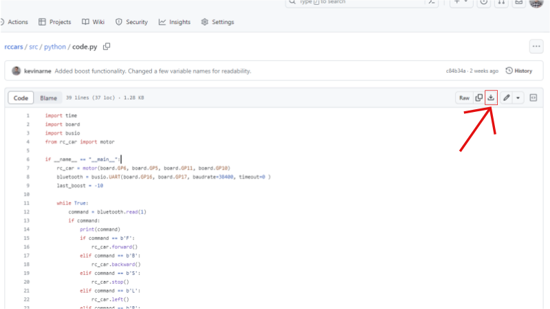

# Purpose

The following tutorial will get you up and running to build an RC car with the provided materials. All of the soldering is already done and the most of the code is flashed onto the brain board. It will be your responsibility to use the tools provided to you in your orientation bag along with the tools available in the Prototyping Lab to design and build a chassis for your car.

### Bill of Materials

# Electronics Assembly

1. Collect the above components from the Prototyping Lab staff.

1. Attach the components to the individual boards. AAA battery pack to brain board (only goes in one way). Bluetooth module to Bluetooth board (RCA, not RCM). Motors to motor board (needs a screwdriver and wires may need to be switched later).

    

1. Stack the boards together with the brain at the bottom and Bluetooth at the top. Make sure to align them properly (see image).

    

1. Try placing 3 AAA batteries in their holder and turn it on. If you've assembled everything correctly, the blue and red lights on the underside of the Bluetooth module should start blinking.

# Flashing Code

1. The code for the brain board is written in CircuitPython, which means you will not need to download any software to edit and manipulate the code. 
1. Download the RC Car code from [here](src/python/code.py). Make sure it is named `code.py`.

    

1. Using a micro USB cable, connect the brain board to your computer (you do not need to disconnect the other boards). Your computer should now have a new USB drive available named `CIRCUITPY` where the code is stored.
1. Click and drag `code.py` onto `CIRCUITPY`, replacing the file that is on the drive.
1. Your code should now be running on the brain board. If you would like to edit this code, just open `code.py` in any text editor (TextEdit and NotePad are fine). The new code will run whenever you save.
    1. Editing code this way does not give you access to any debugging outputs, so you may want to edit using [Mu](https://codewith.mu/en/download) or [Thonny](https://thonny.org/) so you can read any `print()` statements you add to the code.
    1. The max speed of the default code is slow, which you may want to change if you want to win the race.
    1. Python uses spacing in a particular way, so you may need to match the indendation of lines.
    1. For more details on how the code works see [here.](src/README.md)

# Connecting via Remote
1. Plug in the 9V batteries on both your remote and turn on the AAA batteries on your car.

1. The lights on the Bluetooth dongles (HC-05) should blink for a while, then stop blinking when they have successfully paired.

1. If it fails to pair, try power cycling the car and the remote.

# Make your Chassis
1. Design and build the body of the RC car, you are welcome to use the materials provided in the Prototyping Labs from cardboard to wood. Make sure it holds everything! If you do decide to use the MDF, birch, or acrylic make sure you have done your [first laser cut tutorial](https://gixlabs.github.io/how_to/first_lasercut.html) before using any of the laser cutters.

1. Attach the gear motors to the body of the RC car that you have designed/built and assemble the tires. Depending on how you attach the motors, you may have to change some wires to get it to move forward (instructions below).

# Debugging Motors
If you have been able to connect to your RC car, but it is going the wrong direction, you may need to swap the motor wires.
- If your car is going backward when it should be going forward - Swap the red and black wires on both motors.
- If your car is going left when it should be going right or right when it should be going left - Swap which side of the motor driver your motors are wired to.
- For other problems, ask a member of the Prototyping Lab staff.

### Congratulations you are now connected to the RC car! Happy racing! 🏁🏎
